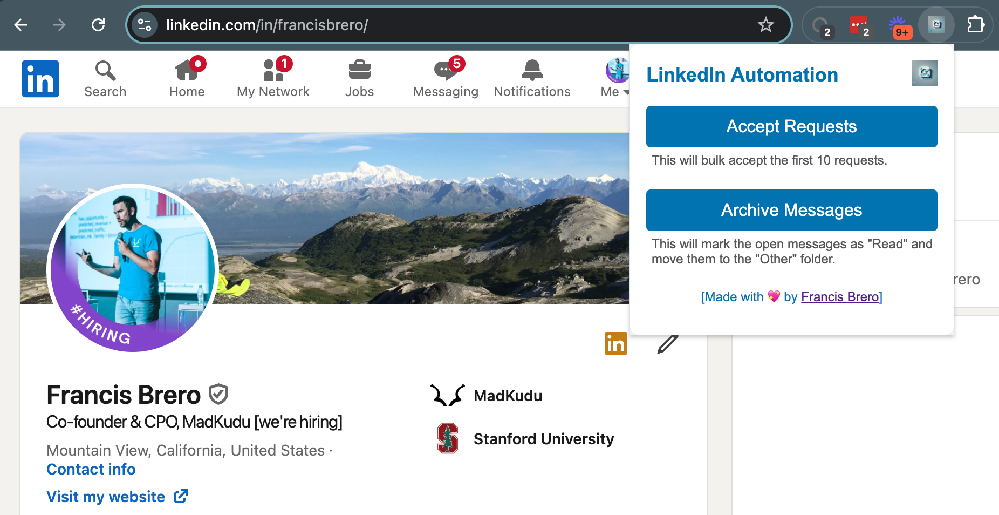

# auto-Linkedin

Put LinkedIn on autopilot, get your time (and sanity) back!



## Overview

The LinkedIn Connection Automation Chrome Extension is designed to streamline the management of incoming LinkedIn connection requests and associated messages. With a simple user interface, this extension allows you to automate the acceptance of connection requests and organize messages by moving them to the "Other" tab and marking them as read.

## Features

- Bulk Connection Acceptance: Automatically accept up to 10 LinkedIn connection requests at a time.
- Message Management: Automatically move messages from accepted connections to the "Other" tab and mark them as read.
- User-Controlled Automation: All actions are triggered by user interaction, ensuring full control over automation.

## Installation

1. Clone the Repository:

```bash
git clone https://github.com/yourusername/linkedin-connection-automation.git
```

2. Load the Extension in Chrome:

Open Chrome and navigate to chrome://extensions/.
Enable "Developer mode" using the toggle in the top right corner.
Click "Load unpacked" and select the directory where you cloned the repository.

3. Start Using the Extension:

The extension icon will appear in the Chrome toolbar.
Click the icon to open the popup and access the automation features.

## Usage

### Accepting Connection Requests

1. Click on the extension icon in the Chrome toolbar.
2. In the popup, click the Accept Connections button.
3. The extension will automatically accept up to 10 connection requests.

### Managing Messages

1. Click on the extension icon in the Chrome toolbar.
2. In the popup, click the Move Messages button.
3. The extension will move messages associated with the accepted connections to the "Other" tab and mark them as read.

## Development

### File Structure

manifest.json: Configuration file for the Chrome extension.
popup.html: The HTML file for the extension's popup interface.
popup.js: Contains the logic for handling user interactions and performing the automation tasks.

### Key Functions

acceptLimitedConnections: Accepts up to 10 LinkedIn connection requests.
moveOpenMessagesToOthers: Moves messages to the "Other" tab and marks them as read.
processMessageCard: Handles the individual processing of each message card, ensuring it is expanded and interacted with correctly.

### Debugging

Use Chrome Developer Tools (F12) to view console logs and troubleshoot issues.
The script includes extensive console.log statements to track the execution flow and identify potential issues.

### Known Issues

LinkedIn’s DOM structure may change over time, potentially breaking the selectors used by the extension. If this occurs, you may need to update the selectors in the popup.js file.

## License

This project is licensed under the MIT License. See the LICENSE file for more details.

## Contributing

Contributions are welcome! If you have suggestions or find issues, please open an issue or submit a pull request.

## Contact

For any inquiries or support, please contact me by creating an issue.